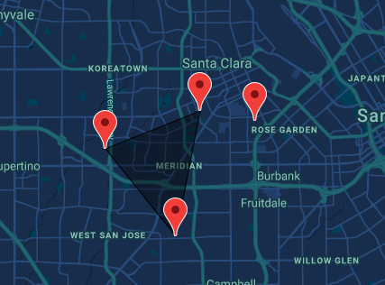

## Shape Wars

### The original goal for this project was to create a multi user web app that utilized players real time locations.

### Welcome to Shape Wars!

#### Shape wars is a game that allows you to compete with and work alongside other players. The goal of the game is to build off of one anothers shapes while also earning the most points for yourself. (See the home page of the app for more info)

#### The functionality of the app right now is in a ‘demo’ mode. So for right now instead of placing a marker only at your physical location the app responds to clicks on a map. THe commented out code does work with the functionality the way it’s intended, in which you would click the 'submit' button and it will only place a marker if you are physically in that spot.

### Project Goal

- Create a MERN stack app that utilized geolocation data
- Create a login system and save/retreive data created by the user to MongoDB

### Technologies used:

- React
- Express
- Mongoose
- Node.js
- MongoDB
- Google Maps API
- react-google-maps npm

### Future Goals:

- Create a high scores list of all users scores
- Recreate this app on React Native (implemenation makes a lot more sence for mobile)

